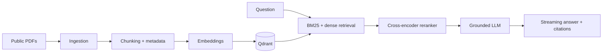

# Enterprise Multi-Document RAG Agent

[](https://github.com/MayankYadav-ds/enterprise-rag-agent/actions/workflows/ci.yml)
[](https://www.python.org/downloads/release/python-3110/)
[](LICENSE)

A production-minded AI research assistant that answers questions across complex documents with page-level, grounded citations.

> **Project status:** foundation complete. Ingestion, retrieval, generation, evaluation, and the demo are built incrementally in documented phases.

## The problem

Long reports and technical manuals are difficult to search reliably. This project will ingest selected public documents, retrieve the most relevant evidence with both lexical and semantic search, and generate answers only when that evidence is strong enough. Weak retrieval should result in a transparent "I don't have enough evidence" response rather than a confident guess.

## Planned capabilities

- Parse PDFs while preserving page, section, table, and source metadata.
- Compare fixed-size, recursive, and structure-aware chunking.
- Combine BM25 and dense-vector retrieval with reciprocal-rank fusion and reranking.
- Stream grounded answers over Server-Sent Events, with document and page citations.
- Evaluate retrieval and answer quality using a reproducible gold set and RAGAS.

## Architecture



## Tech stack

| Concern | Choice | Why |
| --- | --- | --- |
| Runtime | Python 3.11 | Broad ML and backend support |
| RAG orchestration | LangChain | Modular retriever and streaming integrations |
| Vector database | Qdrant | Self-hostable filtering and vector search |
| Embeddings / reranking | sentence-transformers | Local-capable, well-tested models |
| API | FastAPI + SSE | Typed API with native async streaming |
| Quality | pytest, Ruff, pre-commit, GitHub Actions | Fast repeatable checks |

## Quick start

Phase 9 will provide the final one-command demo:

```bash
docker-compose up --build
```

For the current foundation, create a Python 3.11 virtual environment and run the quality checks:

```bash
python -m pip install -e ".[dev]"
pre-commit install
ruff check .
pytest
```

Copy `.env.example` to `.env` before configuring a model provider. Do not commit `.env` or API keys.

## API example

The `/ingest`, `/query`, and `/health` endpoints arrive in Phase 7. The final query flow will look like:

```bash
curl -N -X POST http://localhost:8000/query \
  -H "content-type: application/json" \
  -d '{"question":"What risks did the company identify?"}'
```

## Evaluation

No evaluation has been run yet; this repository will not publish placeholder scores. Phase 8 will add the gold set, reproducible commands, and an ablation table with measured results in [docs/EVALUATION.md](docs/EVALUATION.md).

## Design decisions and trade-offs

The project uses LangChain for composable retrieval and provider-agnostic streaming, Qdrant for local vector storage, and a hybrid retrieval strategy to balance exact terminology with semantic matches. More detailed decisions—including alternatives considered—are in [docs/DECISIONS.md](docs/DECISIONS.md).

## Project structure

```text
src/rag_agent/        Application package
  ingestion/          PDF parsing and normalisation
  chunking/           Chunking strategies
  embeddings/         Embedding and vector indexing
  retrieval/          BM25, dense, fusion, reranking
  generation/         Grounded prompts and citations
  api/                FastAPI endpoints
  evaluation/         RAGAS and retrieval metrics
tests/                 Unit and integration tests
data/                  Legally usable source documents and provenance
docs/                  Architecture, decisions, and evaluation records
scripts/               Repeatable developer commands
.github/workflows/    Continuous integration
```

## Limitations and future work

The current repository intentionally contains only the foundation. Planned phases will add PDF ingestion, vector storage, retrieval, answer generation, evaluation, and a Dockerised UI. OCR quality, table extraction, context-window limits, and model-provider costs will be explicitly tested and documented as the system develops.

## Contributing

Contributions are welcome once the initial pipeline is in place. Read [CONTRIBUTING.md](CONTRIBUTING.md) for local setup and quality expectations.

## License

Released under the [MIT License](LICENSE).
