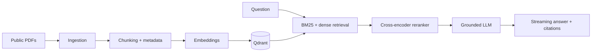
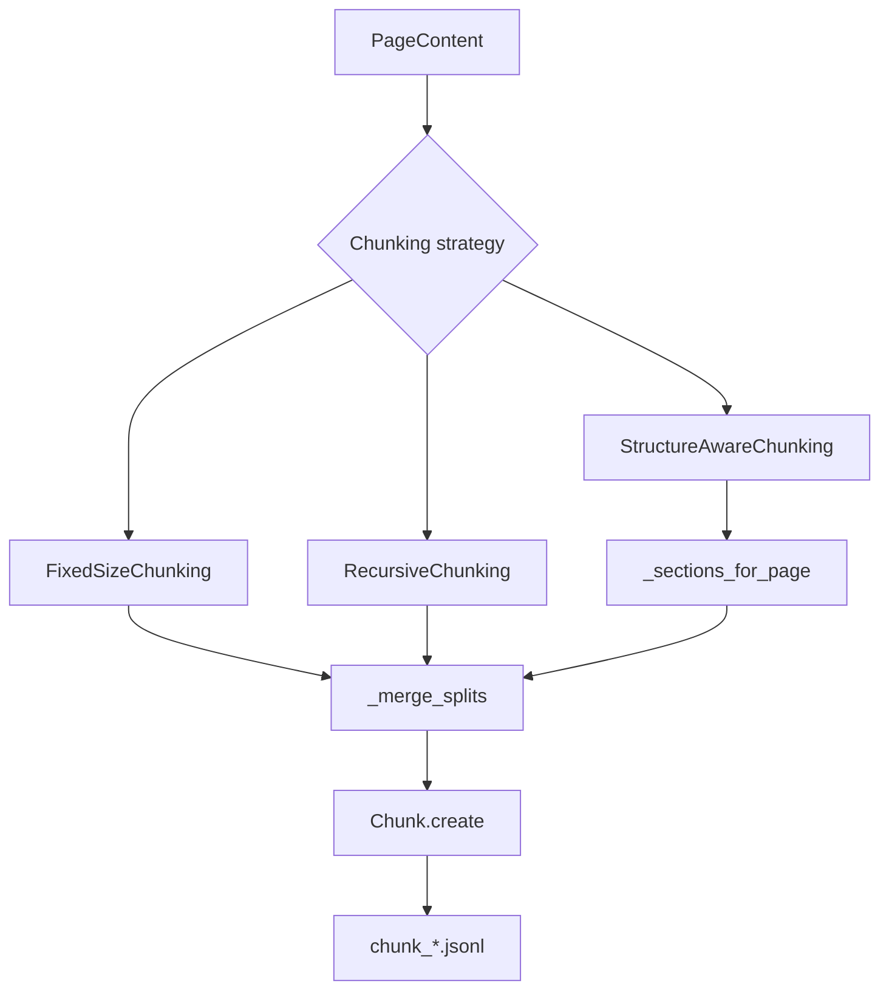

# Architecture

## Overview

The agent ingests public PDFs, chunks them, indexes the chunks, and answers
questions over the indexed evidence with page-level citations.

## Ingestion

`src/rag_agent/ingestion/` parses each PDF into a hash-named JSON record:

- PyMuPDF extracts positioned text spans with font size and bold flags.
- pdfplumber extracts ruled tables as Markdown.
- `clean_text` normalises Unicode, repairs hyphenated line breaks, and drops
  private-use area glyphs (`Co`) and format characters (`Cf`).
- Repeated edge headers/footers and standalone printed page numbers are removed.
- Each page is scored 0-1; pages below 0.900 warn about extraction artifacts.

## Chunking

`src/rag_agent/chunking/` implements three strategies behind a common
interface. The chunking step is the focus of this phase.

### Fixed-size

Sentences are packed into chunks of approximately `chunk_size` tokens with
`chunk_overlap` tokens of carry-over. Simplest and fastest; boundaries fall at
arbitrary sentence positions.

### Recursive

Splits by paragraph, then sentence, then word, then merges with overlap. The
paragraph/sentence boundaries are the same as fixed-size, but oversized
paragraphs are split by sentence boundary before falling back to a
character-boundary cut, so chunks end at a natural sentence end more often.

### Structure-aware

Splits each page by detected headings first, then applies recursive chunking
within each section. A heading names the section that **follows** it; a
trailing heading with no body on its page is dropped rather than glued onto
the previous section's body. SEC "Item NN." headings are recognised by pattern
in both the ingestion detector and the chunker's fallback.

### Shared rules

- Tables are atomic units, split by rows with header repetition when they
  exceed chunk size.
- Pages below the text-quality threshold are excluded by default.
- No empty or near-empty chunks are produced (minimum size enforced).
- Chunk IDs are deterministic: `chunk_<doc_id>_<8-hex-position>_<16-hex-sha256>`.

## Retrieval, generation, evaluation

`src/rag_agent/retrieval/` combines BM25 and dense-vector retrieval with
reciprocal-rank fusion and a cross-encoder reranker. `src/rag_agent/generation/`
streams grounded answers over Server-Sent Events with document and page
citations. `src/rag_agent/evaluation/` runs RAGAS and retrieval metrics against
a reproducible gold set. These phases are built incrementally and documented in
[docs/DECISIONS.md](docs/DECISIONS.md).
