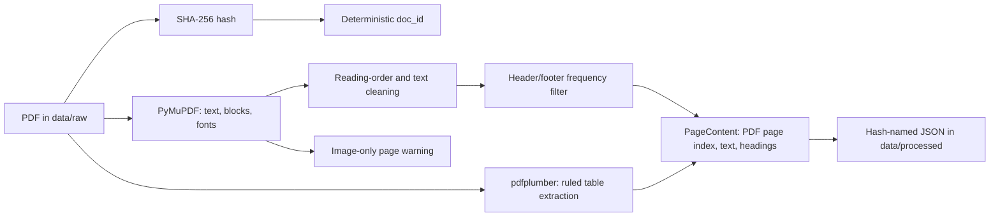
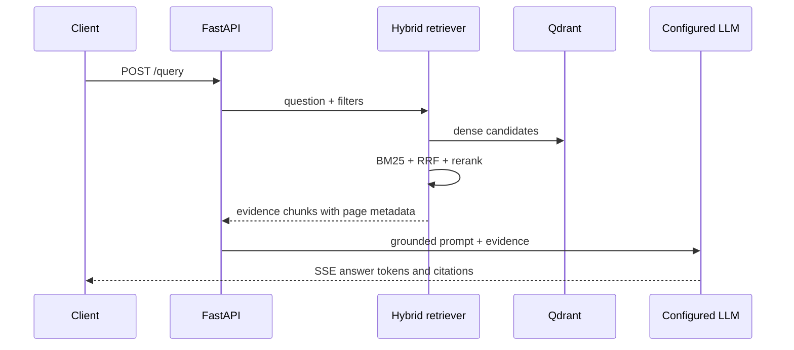

# Architecture

## Current state

Phase 2 implements local, page-aware PDF ingestion. The pipeline persists deterministic JSON records in `data/processed/`, which remains outside version control. Vector storage, model calls, and HTTP endpoints are not implemented yet.

## Ingestion flow

`PageContent.page_number` is the one-based physical PDF page index. It deliberately does not attempt to reconcile a filing's printed page number, which can start after cover and contents pages.

## Target request path

## Architectural invariants

- Each chunk keeps document identity and page number from ingestion through generation.
- Retrieval quality is measured independently from generative quality.
- Answer generation receives only retrieved evidence, and declines to answer when evidence does not meet a configured threshold.
- Provider credentials stay in environment variables and never enter version control or logs.

The details will be updated as each component is implemented.
