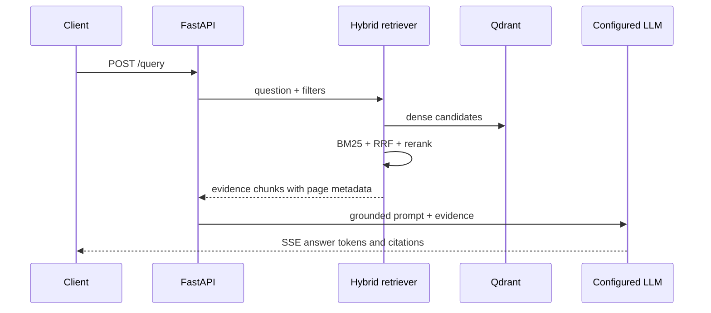

# Architecture

## Current state

Phase 1 establishes the Python package boundary, configuration conventions, and quality gate. No document content, model, vector database, or HTTP server is implemented yet.

## Target request path

## Architectural invariants

- Each chunk keeps document identity and page number from ingestion through generation.
- Retrieval quality is measured independently from generative quality.
- Answer generation receives only retrieved evidence, and declines to answer when evidence does not meet a configured threshold.
- Provider credentials stay in environment variables and never enter version control or logs.

The details will be updated as each component is implemented.
